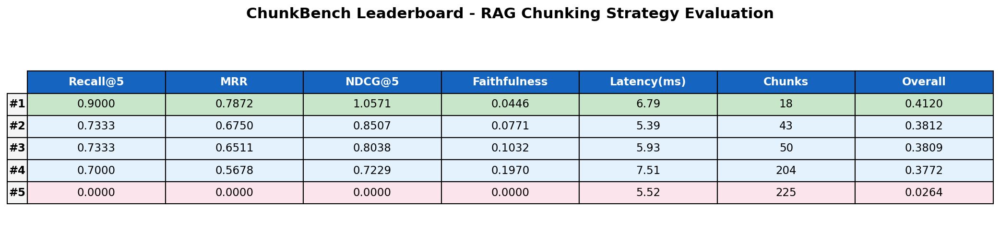
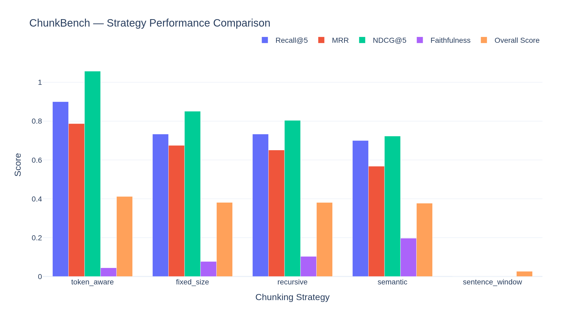
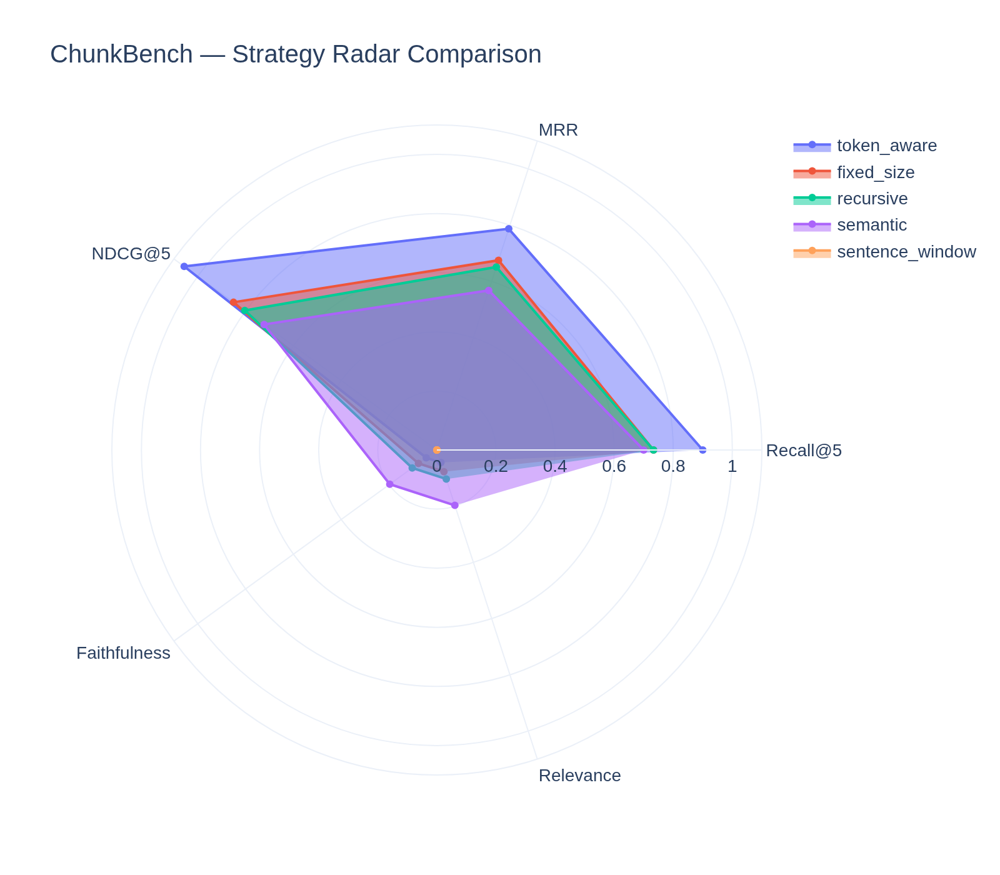
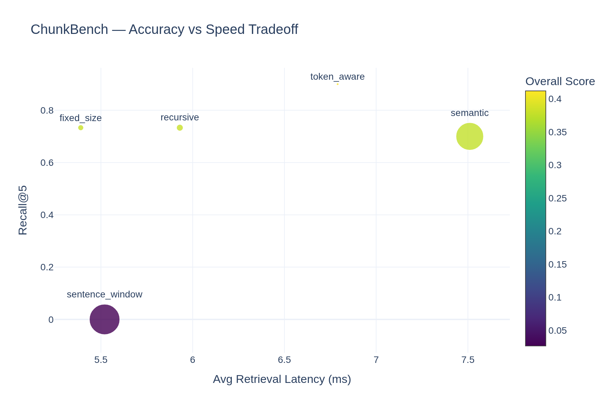

# ChunkBench

[English](./README.md) | 简体中文

> 基准测试每种 RAG 分块策略，而不是凭直觉选择。


## 基准测试结果









## 为什么选择 ChunkBench

在构建 RAG 应用时，选择正确的分块策略至关重要——但大多数团队凭直觉选择。ChunkBench 自动化对比流程：给定文档和问答测试集，运行所有策略并生成包含检索准确率、忠实度和延迟指标的排行榜。

## 支持的策略

| 策略 | 描述 | 适用场景 |
|---|---|---|
| **固定大小** | 按字符数分割，支持重叠 | 简单基线，速度快 |
| **递归** | 按分隔符层级分割（段落→句子→词） | 通用场景 |
| **Token 感知** | 在句子边界精确控制 token 数 | LLM 上下文窗口 |
| **句子窗口** | 索引单句，检索时带回上下文 | 精确匹配 |
| **语义分块** | 使用嵌入向量在语义断点处分割 | 主题连贯性 |
| **延迟分块** | 先嵌入完整文档，再分块 | 全局上下文保留 |
| **命题分解** | 通过 LLM 分解为原子事实 | 最高精度 |

## 架构

```
文档 → [加载器] → 文本 + 元数据
                          ↓
              [分块器 × 7] → 每种策略的 List[Chunk]
                          ↓
              [嵌入器] → 向量表示
                          ↓
              [检索器 (ChromaDB)] → Top-K 分块
                          ↓
              [评估器] → Recall@K / MRR / 忠实度 / 延迟
                          ↓
              [排行榜 + 可视化] → 对比报告
```

## 安装

```bash
git clone https://github.com/Apageoflove/chunkbench.git
cd chunkbench
pip install -e .
```

> 无需 API Key。嵌入模型使用本地 `all-MiniLM-L6-v2`。

## 快速开始

### Python API

```python
from chunkbench.benchmark import Benchmark

bench = Benchmark(
    documents="./examples/sample_docs/",
    qa_pairs="./examples/sample_qa.jsonl",
    strategies=["fixed_size", "recursive", "semantic", "sentence_window"],
)

report = bench.run()
report.show_leaderboard()
```

### 命令行

```bash
chunkbench run --docs ./examples/sample_docs/ --qa ./examples/sample_qa.jsonl
chunkbench run --config examples/config_example.yaml
chunkbench list-strategies
```

### Gradio 演示

```bash
python demo/app.py
# 打开 http://localhost:7860
```

## 评估指标

| 指标 | 描述 | 计算方式 |
|---|---|---|
| **Recall@K** | Top-K 检索命中率 | 前 K 个中找到的相关文档 / 总相关文档 |
| **MRR** | 平均倒数排名 | 首个相关结果排名倒数的平均值 |
| **NDCG@5** | 归一化折损增益 | 位置 5 的 DCG / 理想 DCG |
| **忠实度** | 答案基于上下文 | LLM 评判或 ROUGE-L（回退） |
| **相关性** | 答案针对问题 | LLM 评判或 ROUGE-L（回退） |
| **综合得分** | 加权组合 | R@5×0.25 + MRR×0.20 + 忠实度×0.25 + 相关性×0.20 + 延迟×0.10 |

## 无需 API Key

ChunkBench 完全无需任何 API Key 即可运行：

- **忠实度和相关性**回退到 ROUGE-L 评分
- **命题分块器**回退到句子级分割
- 所有其他策略正常运行

启用 LLM 功能：

```bash
export OPENAI_API_KEY=sk-xxx
```

## 项目结构

```
chunkbench/
├── chunkbench/
│   ├── chunkers/          # 7 种分块策略
│   ├── pipeline/          # 嵌入、检索、运行器
│   ├── evaluators/        # 检索、生成、延迟评估
│   ├── loaders/           # 文档和问答加载
│   ├── reporters/         # 排行榜和可视化
│   ├── benchmark.py       # 主入口
│   └── cli.py             # 命令行接口
├── demo/                  # Gradio Web 演示
├── examples/              # 示例数据和配置
├── tests/                 # 测试套件
└── requirements.txt
```

## 路线图

- [ ] 支持更多嵌入模型（Cohere、Voyage）
- [ ] BEIR 数据集自动下载
- [ ] 自定义策略插件注册
- [ ] 多语言支持
- [ ] 分布式基准测试

## 许可证

[MIT](https://opensource.org/license/mit/)
